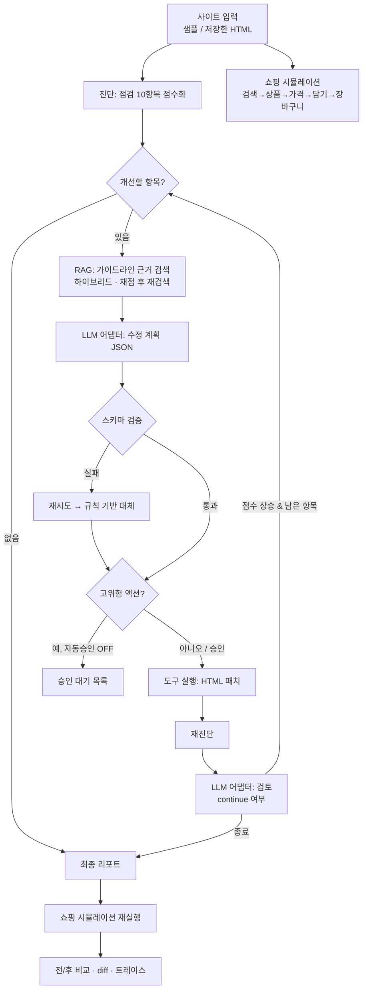

# AgentReady 아키텍처

## 1. 개요
AI 쇼핑 에이전트가 쓰기 좋은 사이트인지 진단(점수화)하고, **에이전트가 스스로 판단해 수정 → 재진단하는 루프**로 개선하는 에이전트형 RAG 프로그램.

## 2. 에이전트 루프

핵심은 **판단(계획) → 도구 실행 → 재진단(검증) → 계속/중단 판단**의 반복이다. 한 번에 끝나지 않고 반복당 수정 수를 제한해 점수가 오르는 것을 확인하며 진행한다.

## 3. 기술스택

| 영역 | 구성 | 비고 |
|---|---|---|
| 언어/런타임 | Python 3.10+ | |
| HTML 분석/패치 | BeautifulSoup4 (html.parser) | 점검·시뮬레이션·수정 모두 결정적 규칙 |
| 검색(RAG) | TF-IDF(문자 n-gram) + BM25 + RRF 결합, 교정형 검색(채점·재검색), 임베딩 옵션 | 오프라인 동작, 50조각 지식 베이스, Recall 측정(eval_rag.py) |
| LLM | 교체형 어댑터: Mock / OpenAI 호환 / Anthropic / Replay | `.env` 로 선택 |
| 에이전트 오케스트레이션 | 직접 구현한 루프(`agent.py`) | 계획·검증·재시도·승인·종료 조건 |
| UI | Streamlit | 점수, 시뮬레이션, 트레이스, diff, RAG 근거, 미리보기 |
| 테스트/평가 | pytest(41개), `run_eval.py` | 샘플별 전/후 점수 자동 측정 |

## 4. 구성 요소

| 모듈 | 역할 |
|---|---|
| `checks.py` | 점검 10항목(가중치 합 100) 점수 산정 |
| `simulator.py` | 규칙 기반 쇼핑 에이전트 시뮬레이터 (LLM 불필요) |
| `rag.py` | 가이드라인 청크 → 하이브리드 검색(TF-IDF·BM25·선택 임베딩, RRF) |
| `llm.py` | LLM 어댑터, 응답 JSON 파싱, 녹화/재생 |
| `patcher.py` | 수정 액션(도구) 9종과 위험도(low/high) 정의 |
| `agent.py` | 에이전트 루프, 응답 검증, 승인, 트레이스, diff |
| `prompts/*.txt` | 계획/검토/요약 프롬프트 (파일로 분리) |

## 5. 점검 항목과 가중치

| 항목 | 가중치 | 수정 액션 | 위험도 |
|---|---|---|---|
| 표준 클릭 요소(a/button) | 18 | semantic_clickables | high |
| 상품 구조화 데이터(JSON-LD) | 16 | add_jsonld | high |
| 가격 마크업 | 12 | price_markup | low |
| 재고 상태 표기 | 8 | add_jsonld | high |
| 폼 입력 라벨 | 8 | add_labels | low |
| 시맨틱 랜드마크 | 8 | add_landmarks | low |
| 제목 구조 | 8 | fix_headings | low |
| title/description/OG | 8 | add_meta | low |
| 이미지 alt | 8 | alt_text | low |
| robots.txt / llms.txt | 6 | add_machine_files | high |

## 6. 안전장치
- **액션 화이트리스트**: LLM 은 등록된 액션 이름만 선택할 수 있고, 실제 HTML 변경은 결정적 코드가 수행한다. 위험도도 LLM 이 아닌 코드가 결정한다.
- **응답 검증**: JSON 스키마 검증 실패 시 재시도(최대 2회) 후 규칙 기반 계획으로 대체한다.
- **Human-in-the-loop**: DOM 구조 변경, 재고 상태 추정, 크롤링 정책 공개는 고위험으로 분류되어 자동 승인을 끄면 승인 대기로 남는다.
- **원본 보존**: 수정은 사이트 사본에만 적용하고 원본은 변경하지 않는다. 변경 내역은 diff 로 확인한다.
- **업로드 HTML 비실행**: 업로드한 HTML 은 UI 에서 렌더링하지 않는다.

## 7. 내부망 운영
- 외부 호출이 필요 없는 기본 구성(Mock + TF-IDF + 규칙 시뮬레이션)으로 완전 오프라인 동작.
- 실제 LLM 은 외부망에서 `RECORD=1` 로 응답을 녹화하고, 내부망에서는 `LLM_PROVIDER=replay` 로 재생해 시연한다.

## 8. 점수 체계 확장 (v0.2)
- **구조 점수(10항목, 100점)**: 기존 점검. 읽기·조작 가능성.
- **선택 지표(6항목, 100점, 추론 기반)**: 정적 HTML 상품 정보 20, 배송·반품 20, 리뷰·평점 15, 가격 일치 15, 팝업·배너 15, 로그인·캡차 15. 가중치는 에이전트 실험으로 검증하기 전의 추정값이다.
- **직접 조치 항목**: 자동 수정 도구가 없는 항목(정적 HTML, 배송·반품, 리뷰, 팝업, 로그인·캡차)은 에이전트가 계획하지 않고 RAG 가이드로 조치 방법만 안내한다.
- 루프의 진행 판단은 두 점수의 합산 변화로 한다.
